```mermaid
%%{init: {'theme':'base', 'themeVariables': {'primaryColor':'#e8eff5', 'primaryTextColor':'#2c3e50', 'primaryBorderColor':'#6b8fa1', 'lineColor':'#7a9db5', 'secondBkgColor':'#f4f1ed', 'secondTextColor':'#2c3e50', 'tertiaryColor':'#d9e8df', 'tertiaryTextColor':'#2c3e50', 'tertiaryBorderColor':'#7eb3a0', 'noteBkgColor':'#e8ddd5', 'noteBorderColor':'#a88571', 'background':'#fafaf8', 'mainBkg':'#e8eff5', 'clusterBkg':'#f4f1ed', 'clusterBorder':'#6b8fa1'}, 'flowchart': {'htmlLabels': true}}}%%
graph TD
    classDef setupNode fill:#d8e6f0,stroke:#6b8fa1,stroke-width:2px,color:#2c3e50
    classDef processNode fill:#e2ecf3,stroke:#7a9db5,stroke-width:2px,color:#2c3e50
    classDef historyNode fill:#e8ddd5,stroke:#a88571,stroke-width:2px,color:#4a3728
    classDef testNode fill:#dce3f1,stroke:#6b7fa1,stroke-width:2px,color:#2c3e50
    classDef decisionNode fill:#e8e3d5,stroke:#9d9073,stroke-width:2px,color:#4a3728
    classDef successNode fill:#d9e8df,stroke:#7eb3a0,stroke-width:2px,color:#2c3e50
    classDef endNode fill:#d8e6f0,stroke:#6b8fa1,stroke-width:2px,color:#2c3e50

    Start["START: SCD2 Macro-Driven Pipeline"] --> A
    class Start endNode

    subgraph Setup["SETUP Phase One-time or CI"]
        A["Define vars.scd2_dimensions<br/>in dbt_project.yml<br/><br/>- name: dim_entity<br/>- source: stg_entity<br/>- natural_key: entity_id<br/>- change_date_column: DATE<br/>- presentation_exclude: [...]"]
        B["Run:<br/>dbt run-operation scd2_generate_shims"]
        C["Generate 4 shim files per dimension:<br/>* *__history.sql<br/>* *__candidate.sql<br/>* *__published.sql<br/>* *__gates.sql"]
        A --> B --> C
    end

    C --> Parse["dbt parses shims<br/>as generated models<br/><br/>Next dbt run picks up changes"]
    Parse --> RunStart["dbt build / run"]

    subgraph Bootstrap["BOOTSTRAP on-run-start"]
        D["scd2_bootstrap_audit"]
        D1["Create audit.scd2_approved_batches<br/>Create audit.scd2_rollback_log"]
        D --> D1
    end

    RunStart --> Bootstrap

    Bootstrap --> Staging["Staging models run<br/>Load new extract data<br/>into stg_* tables<br/><br/>Example: stg_entity with<br/>- entity_id natural key<br/>- name, email, status attributes<br/>- _landing_extract_date change_date<br/>- attribute_hash content hash"]

    Staging --> HistStart["*__history Model Materialization"]

    subgraph History["HISTORY: Insert-Only History Table"]
        J1["Pre-hook:<br/>scd2_purge_unapproved"]
        J1a["DELETE FROM history<br/>WHERE NOT EXISTS<br/>audit.scd2_approved_batches"]
        J1 --> J1a

        J2["Schema Drift Detection<br/>scd2_resolve_attributes"]
        J2a["Union staging cols + existing history cols<br/><br/>* New column? → ALTER ADD ... NULL<br/>* Departed? → CAST NULL<br/>* Type mismatch? → Hard ERROR"]
        J2 --> J2a

        J3["Insert Logic"]
        J3a["For each row in staging:<br/>- Surrogate key = MD5 of natural_key<br/>- valid_from = change_date<br/>- attribute_hash = staging hash<br/>- _batch_id = current run_id<br/>- _loaded_at = now<br/><br/>Incremental: Only insert WHERE NOT IN<br/>change_date, natural_key"]
        J3 --> J3a

        J1a --> J2 --> J3
    end

    HistStart --> History

    History --> CandView["*__candidate View<br/>Over history + LEAD window"]
    CandView --> CandLogic["SELECT *,<br/>LEAD valid_from<br/>OVER PARTITION BY surrogate_key<br/>ORDER BY valid_from as valid_to,<br/>CASE<br/>WHEN valid_to IS NULL THEN 1<br/>ELSE 0<br/>END as is_current<br/>FROM history"]

    CandLogic --> PubView["*__published View<br/>Approval-gated view"]
    PubView --> PubLogic["SELECT * FROM candidate<br/>WHERE EXISTS<br/>SELECT 1<br/>FROM audit.scd2_approved_batches<br/>WHERE batch_id = candidate._batch_id<br/><br/>Only approved batches exposed!"]

    PubLogic --> Tests["*__gates Test: scd2_gate_test"]

    subgraph TestSuite["GATE TESTS Consolidated"]
        T1["GRAIN TEST<br/>Unique surrogate_key per row"]
        T2["NULLS TEST<br/>natural_key columns NOT NULL"]
        T3["SINGLE-CURRENT TEST<br/>max 1 row per natural_key<br/>where is_current = 1"]
        T4["VOLUME GUARD<br/>Check recent growth<br/>if diffs > threshold fail"]
        T5["RECONCILIATION<br/>published records subset of<br/>latest staging extract<br/><br/>grain + nulls must match"]
        T1 --> T2 --> T3 --> T4 --> T5
    end

    Tests --> TestSuite

    TestSuite --> Decision{"All tests<br/>passed?<br/><br/>No error-level<br/>failures?"}

    Decision -->|FAIL| Pending["Block Approval<br/><br/>- Batch remains in<br/>pending state<br/>- Previous published<br/>version still active<br/>- Operator reviews failures"]

    Decision -->|PASS| Approve["on-run-end:<br/>scd2_approve_batches"]

    subgraph ApproveLogic["APPROVAL and PUBLISH"]
        AP1["Insert into<br/>audit.scd2_approved_batches<br/>- batch_id<br/>- approved_at<br/>- created_by"]
        AP2["Invoke<br/>scd2_refresh_published"]
        AP1 --> AP2
    end

    Approve --> ApproveLogic

    ApgLogic["CTAS + RENAME SWAP<br/><br/>1. CREATE TABLE dim_entity__new<br/>WITH DISTRIBUTION = HASH entity_id,<br/>CLUSTERED COLUMNSTORE INDEX<br/>AS SELECT * FROM dim_entity__published<br/><br/>2. RENAME OBJECT<br/>dim_entity → dim_entity__old<br/>dim_entity__new → dim_entity<br/><br/>3. DROP dim_entity__old<br/><br/>Metadata-only swap!"]

    ApproveLogic --> ApgLogic

    ApgLogic --> Published["Published Table Ready<br/><br/>- Clustered columnstore<br/>- Approved batch data<br/>- Queries see new data"]

    Pending --> Consume["Consumption Phase<br/><br/>Consumers query:<br/>SELECT * FROM mart.dim_entity<br/>WHERE is_current = 1<br/><br/>Returns:<br/>- Current records only<br/>- No NULL surrogate keys<br/>- All approved historical data auditable"]

    Published --> Consume

    Consume --> Optional["Optional: Manual Rollback"]

    subgraph Rollback["ROLLBACK FLOW Operator"]
        RB1["dbt run-operation scd2_rollback<br/>--args batch_id: 123"]
        RB2["Dry-run mode default:<br/>SELECT rows that would<br/>be deleted from history"]
        RB3["Review + Confirm deletion<br/>Operator approves"]
        RB4["DELETE from history<br/>WHERE _batch_id = 123<br/><br/>Log to audit.scd2_rollback_log:<br/>- rolled_back_by<br/>- batch_id<br/>- rolled_back_at"]
        RB5["scd2_refresh_published<br/>rebuilds from remaining rows"]
        RB6["Optional: scd2_restore_last_rollback<br/>Re-approve rolled-back batches"]

        RB1 --> RB2 --> RB3 --> RB4 --> RB5
        RB5 --> RB6
    end

    Optional --> Rollback
    RB5 --> Consume

    Consume --> End["END<br/>Complete auditability<br/>Full history preserved<br/>SCD2 Type 2 semantics"]
    class End endNode

    class A,B,C setupNode
    class Parse,RunStart,D,D1,Staging processNode
    class HistStart,J1,J1a,J2,J2a,J3,J3a historyNode
    class CandView,CandLogic,PubView,PubLogic processNode
    class Tests,TestSuite,T1,T2,T3,T4,T5 testNode
    class Decision decisionNode
    class Pending decisionNode
    class Approve,AP1,AP2,ApproveLogic,ApgLogic,Published successNode
    class Consume processNode
    class Optional decisionNode
    class Rollback,RB1,RB2,RB3,RB4,RB5,RB6 historyNode
```

## Key Decision Points & Flows

| Decision Point | Path | Outcome |
|---|---|---|
| **Test Failures** | FAIL | Batch blocked, pending state, previous version stays published |
| **All Tests Pass** | PASS | Batch approved, CTAS swap executed, new version published |
| **Schema Drift: New Column** | Auto-handled | `ALTER TABLE ADD` (metadata-only on CCI) |
| **Schema Drift: Departed Column** | Auto-handled | Project `CAST(NULL AS stored_type)` forever |
| **Schema Drift: Type Mismatch** | Error | Hard compile error (no silent truncation allowed) |

## Critical Safeguards Built In

- **Pre-hook purge** — removes unapproved rows before insert
- **Approval gate** — blocks all consumption until tests pass + operator approval
- **CTAS+RENAME** — atomic metadata-only swap (Synapse safe)
- **Schema drift detection** — auto-detects new/departed/type-mismatched columns
- **Rollback log** — every deletion tracked with timestamp + operator
- **Grain testing** — catches duplicate keys before publication
- **Volume guard** — prevents runaway growth (suspicious inserts)
- **Reconciliation** — published rows must exist in latest extract
